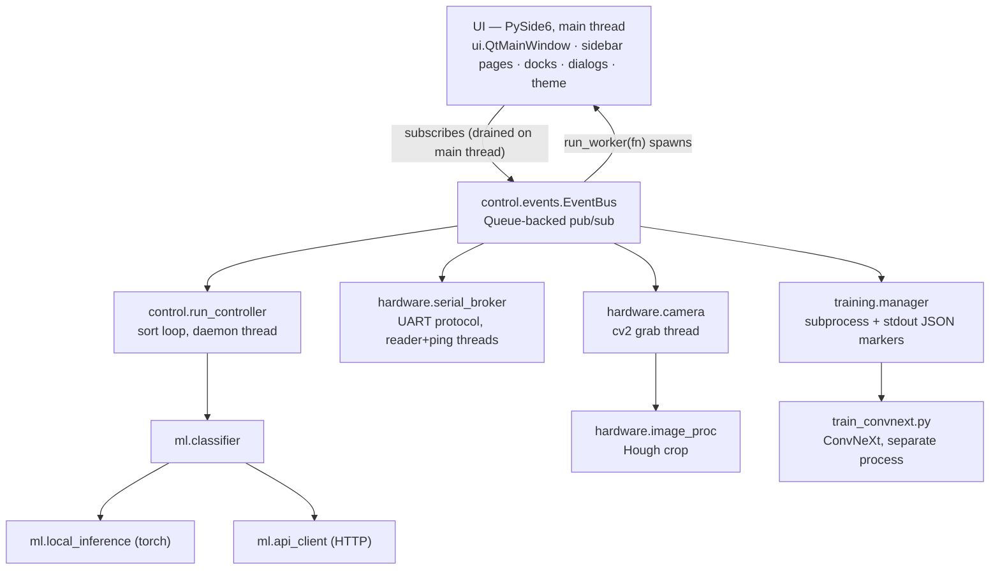
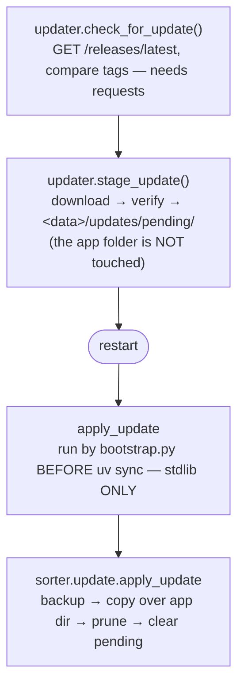

# CLAUDE.md

Guidance for AI assistants (and humans) working in this repository. It maps the
architecture, the moving parts, and the conventions so a new contributor can be
productive without reverse-engineering the whole tree. **Keep this file current:
when you add a page, change the data model, or alter a subsystem boundary, update
the relevant section here in the same change.**

**Docs are part of every functionality change, visible or not.** A change that
alters behavior ships with its documentation in the same change: this file's
relevant section, the module docstring it invalidates, `docs/guide/GUIDE.md`
for anything an operator can see or do (its headings are load-bearing — the F1
help maps to them; `tests/unit/ui/test_help.py` pins the anchors), and
`docs/ui-modernization.md` for UI design decisions. Stale docs are bugs:
they were the direct cause of a full retroactive documentation sweep on
2026-08-14, and the guide misdirecting an operator is a user-facing defect.

**The published site is user-facing only.** `mkdocs.yml`'s nav is the whole
of it — home, `install.md`, `getting-started.md`, `guide/GUIDE.md`,
`troubleshooting.md` — and `mkdocs-pdf.yml` renders the same pages as one PDF
per release. Contributor documents stay in `docs/` and go in `exclude_docs`
(`ui-modernization.md` is the only one so far); a decision record reaching an
operator as a chapter of the manual is what that list exists to stop.

---

## 1. What this project is

The **AI Case Sorter** is a cross-platform (Windows + Linux/Ubuntu + macOS) desktop
application that drives a physical machine which sorts spent brass cartridge
casings by **headstamp** (the stamp on the base of the case). A camera
photographs each case, an image classifier predicts the headstamp, and a
serial-connected sorting machine drops the case into the correct bin.

It is the **full-parity Python/Qt version of the existing Windows-only
WinForms application** and is intended to eventually replace it. Much of the
code deliberately mirrors the WinForms behavior.

The "community" features (model sharing, downloads, feedback loop) authenticate
against a hosted backend at `reloadingrecipes.com` via Azure AD B2C. The app
runs fully without ever signing in — community features are the only auth-gated
surface.

Two ways to classify:
- **Over HTTP** (`/v1/chat/completions` on an OpenAI-compatible server) — two
  spellings of the same backend: **AI Config mode** (no active model, one
  app-level config) and an active **openai-mode model** (`model_mode =
  "openai"`), which carries its *own* `AIModelConfig` and headstamp list so
  several such models can coexist, exactly as the Windows app's "OpenAI API"
  Training Mode does.
- **Local model mode**: run a PyTorch **ConvNeXt** model locally. The model can
  be one the user trained on the Train page, a pretrained model downloaded from
  the community, or one imported from a ZIP — running locally does **not** require
  the user to have trained it. PyTorch is an **optional** dependency
  (`pip install .[ml]`) installed on demand.

---

## 2. Running, testing, layout

**Entry point:** `src/sorter/__main__.py` → initializes paths, opens the
SQLite DB (migrating from a legacy `data/config.json` if present), loads
`Config`, and launches `sorter.ui.app.run_app`. Launched as
`python -m sorter` with `PYTHONPATH=src`, which `bootstrap.py` sets on the
child process — the package is deliberately **never installed** into the venv
(`uv sync --no-install-project`), so the environment is what makes `-m`
resolve. **No module in `src/sorter/` may rewrite `sys.path`**
(`tests/unit/test_entry_point.py` enforces it): the launcher owns the path,
and a hand-rolled shim that inserts `src/sorter` instead of `src/` puts every
subpackage on the path as a top-level name, where `ui`, `data` and `update`
shadow same-named third-party packages.

**One exception, and it is never run from this tree:**
`src/sorter/_legacy_entry.py` is copied into the sdist as a root `main.py` by
`pyproject.toml`'s `[tool.hatch.build.targets.sdist.force-include]`. An in-app
update is applied by the copy **already installed**, and every release up to
1.1.0 ends that launch with `python main.py` from a `bootstrap.py` already in
memory when the new tree lands — so the *archive* needs one even though the
source tree doesn't. Keeping it out of the repo root is what lets the source
layout be final: retiring the shim is one deleted line in `pyproject.toml`.
`tests/integration/test_cross_version_update.py` runs 1.1.0's real updater
against a real built sdist to keep all of this honest.

**Launch (handles the Python runtime, system deps, and dependency sync
automatically):**
- Linux/macOS: `./start.sh` (`--auto` / `AUTO_INSTALL=1` auto-confirms `sudo`
  package installs — libGL/glib for opencv, and libxcb-cursor for Qt's xcb
  plugin when there is a display; see below)
- Windows: `start.bat`
- Either just hands off to `bootstrap.py`, which does the actual work via
  [uv](https://docs.astral.sh/uv/): installs uv itself if it isn't already
  present (into a project-local `.uv/`, not system-wide), provisions the
  pinned Python version from `.python-version` (the app's *system* Python only
  has to be new enough to run `bootstrap.py` itself, not to run the app),
  syncs dependencies from the committed `uv.lock`, then launches. See
  `bootstrap.py`'s module docstring for the full ordering and why it has to
  stay stdlib-only.
- Directly (once synced), same as `bootstrap.py` does it — this is the form to
  use under a debugger (insert `-m debugpy --listen 5678 --wait-for-client`
  before `-m sorter`; see CONTRIBUTING.md) or for a tight edit-run loop, since
  `start.sh` re-does uv discovery, the Linux library probe and a sync every
  time:
  ```bash
  PYTHONPATH=src uv run --no-sync python -m sorter     # PowerShell: $env:PYTHONPATH="src"
  ```
  Both halves matter. **`PYTHONPATH=src`** is what `-m` resolves through,
  since the package is never installed. **`--no-sync`** because a bare `uv
  run` syncs *and installs the project*, firing hatch-vcs's build hook: with
  no `.git` present that overwrites a correct `src/sorter/_version.py` with
  `fallback-version = "0.0.0"`, and `0.0.0+unknown` parses as a pre-release,
  so every launch then sees the current release as newer and re-prompts.

**Tests:** `pytest` from the repo root (`tests/conftest.py` puts `src/` on
`sys.path`; it lives at `tests/` top-level so it applies to both
subdirectories below it). `tests/unit/` mirrors `src/sorter/`'s subpackages
one-for-one (`tests/unit/hardware/`, `tests/unit/data/`, …), plus a handful of
modules that test something at the package's own top level (`test_paths.py`,
`test_bootstrap.py`, `test_version.py`) or outside it entirely — the shipped
scripts and CI plumbing (`test_installer_scripts.py`,
`test_next_prerelease.py`, `test_workflow_permissions.py`) — and stay
directly under `tests/unit/`. Everything in `tests/unit/` uses synthetic
fixtures only; `tests/integration/` stays flat — the files that exercise a
real external tool or service (`uv build`, `git-cliff`, the PyTorch wheel
index) instead, each self-skipping if that tool — or, for the wheel index,
the network — is missing; `pytest -m "not integration"` skips them outright.
`tests/unit/ui/` mirrors `sorter/ui/` like the rest, and runs the whole
UI headless on `QT_QPA_PLATFORM=offscreen` (its `conftest.py` sets it) —
**no Xvfb, no display** (§5, §8).
CI (`.github/workflows/build.yml`) runs the full matrix on every push/PR —
run `pytest` locally before pushing regardless, since CI turnaround is slower
than your own machine. The suite is threading-fragile by design (see
`tests/conftest.py`); don't parallelize it.

**Python:** 3.12+ floor (`pyproject.toml`); `.python-version` pins the actual
version uv provisions for the app itself, independent of that floor. **Core
deps:** pyserial, opencv-python, numpy, Pillow, requests, msal, platformdirs,
sqlite-utils, PySide6-Essentials + pyside6-qtads (+ `pygrabber` on Windows).
**Optional ML deps:** torch, torchvision.

```
AI-Case-Sorter-Py/
├── bootstrap.py              # cross-platform launcher logic (Python+uv+deps+update)
├── start.sh / start.bat     # thin per-OS shims that just call bootstrap.py
├── pyproject.toml           # package metadata; [ml] extra = torch/torchvision
├── uv.lock                  # committed, exact dependency resolution
├── .python-version           # Python version uv provisions for the app
├── src/
│   └── sorter/               # all application code (never installed — see above)
│       ├── __main__.py         # entry point (+ `--apply-update` pre-launch hook)
│       ├── _legacy_entry.py    # shipped as the archive's root main.py; see §2
│       ├── paths.py            # on-disk layout; stdlib-only, imported before uv sync
│       ├── logging_setup.py    # one-shot logging config (§8)
│       ├── control/            # event bus + the sort loop
│       ├── hardware/           # serial, camera, image processing
│       ├── data/                # SQLite persistence + model ZIP import/export
│       ├── ml/                  # classification, local inference, evaluation
│       ├── community/           # auth, community backend client, feedback loop
│       ├── update/              # self-update: check/stage + pre-launch apply
│       ├── training/            # out-of-process ConvNeXt trainer
│       └── ui/                  # PySide6 UI — the only UI (§5)
├── installer/               # Windows bootstrapper (see §7)
├── tools/                   # developer utilities, not shipped or imported
└── tests/                   # pytest suite, mirrors src/sorter/'s subpackages
```

The data root lives **outside** the repo by default — see §6.

---

## 3. Architecture at a glance

The app separates **hardware I/O**, **control logic**, **persistence**, and
**UI** into independent, testable layers, glued by a thread-safe event bus.
Since #58's `src/` layout, that sentence is literally the top level of
`src/sorter/`: `hardware/` ↔ hardware I/O, `control/` ↔ control logic
(the event bus and the sort loop), `data/` ↔ persistence, `ui/` ↔ UI — plus
`ml/` (classification/inference/evaluation), `community/` (auth + the
community backend client + the feedback loop), `update/` (self-update), and
`training/` (the out-of-process trainer), each its own subpackage.



- **Persistence:** `data.config.Config` → `data.repository.*Repo` →
  `data.db.Database` (SQLite, WAL)
- **Filesystem:** `paths.*` (top-level — stdlib-only, imported before `uv
  sync`) defines the `data/` layout; `data.model_io` handles ZIP import/export
- **Community:** `community.auth.AuthManager` (MSAL) →
  `community.community_api.CommunityApi` (HTTPS);
  `community.feedback.FeedbackService` owns the below-threshold image queue

### The event bus (`sorter/control/events.py`)
A single `EventBus` with a thread-safe `Queue`. Workers call `bus.post(topic,
payload)` from any thread; the Qt main loop calls `bus.drain()` on a 50 ms
`QTimer` to dispatch queued events to subscribers **on the main thread**, so
handlers can safely touch widgets. Handler exceptions are **logged with their
topic and then swallowed** — one broken subscriber must not stop the drain,
but it no longer fails silently either (#32).
Topics are slash-namespaced strings: `run/*`, `test/*`, `serial/*`,
`training/*`, `mode/changed`, `feedback/*`, `community/*`. This is the **only**
sanctioned way for worker threads to update the UI.

---

## 4. Module reference (`sorter/`)

### Persistence & configuration (`sorter/data/`)
- **`db.py`** — `Database`: owns one `sqlite3.Connection` (WAL, foreign keys on,
  `check_same_thread=False` with an `RLock` serializing multi-statement
  transactions / SAVEPOINTs). Schema: idempotent DDL plus ordered migration
  steps run through `sqlite_utils.Migrations` (`MIGRATIONS`), whose
  `_sqlite_migrations` tracking table is what decides run-once — `PRAGMA
  user_version` (`SCHEMA_VERSION = 6`) is stamped informationally, never
  downgraded. A legacy DB has no tracking table, so every step runs on first
  open whatever the stamp claims; **every step is therefore presence-guarded
  and idempotent** (that same property repairs databases stamped current by a
  pre-ladder build but structurally incomplete). Step names are load-bearing:
  renaming one makes every install run it again.
  `ensure_initialized()` creates the DB, runs a one-shot import from legacy
  `data/config.json` (renaming it `.bak`), or seeds a default cartridge+model.
  Tables: `cartridges`, `models`, `headstamp_parents`, `headstamps`,
  `slot_templates`, `settings`. One structural fix lives *outside* the
  ladder: `_widen_model_mode_check` rebuilds `models` when its mode CHECK
  predates `'openai'` — a CHECK can't be ALTERed, and the rebuild needs
  `PRAGMA foreign_keys` toggled, which is a silent no-op inside the
  transaction every ladder step runs in (with FKs on, `DROP TABLE models`
  would cascade-delete every headstamp). Guarded structurally off
  `sqlite_master`, like the DDL pass.
- **`repository.py`** — `CartridgeRepo`, `ModelRepo`, `HeadstampRepo`,
  `HeadstampParentRepo`, `SlotTemplateRepo`, `SettingsRepo`. All SQL is
  **parameterized**. `SettingsRepo` is a typed key/value store (JSON-encoded
  values) and holds `default_model_id` (the "active model").
- **`config.py`** — `Config`: in-memory mirror of the `settings` sections (`api`,
  `serial`, `image_proc`, `camera`) plus the canonical `DEFAULTS`. Headstamps are
  **not cached** — they're read fresh from the DB on every access (scoped to the
  active model; AI Config mode stashes them in a settings key). Also the home of
  routing logic: `slot_for_headstamp`, package-mode slot maps, parent
  classifications, auto-select, run options (confidence floor, store-images mode),
  and the sorting-template API (see below).
- **`models.py`** — dataclasses: `Model`, `Headstamp`, `Cartridge`, `SlotTemplate`,
  `TrainingConfig`, `AIModelConfig`, `ImageProcessingConfig`, plus normalizers
  (`normalize_upload_mode`, `SLOT_TEMPLATE_MODES`) and the mode/ownership
  vocabulary: `SUPPORTED_MODEL_MODES` (the trainable ConvNeXt backbones —
  `train_page` assigns a mode straight into `training_config.model_name`, so
  `"openai"` must never join this tuple), `OPENAI_MODEL_MODE` and
  `MODEL_MODES` (what `ModelRepo` accepts), `is_openai_model`, and
  `model_mode_label` — the user-facing spellings ("ConvNeXt-Tiny",
  "OpenAI", the Windows app's Training Mode names) that every UI surface
  prints while storage keeps the snake_case identifiers; the editor combo
  carries the identifier as item *data*, and `_normalize_model_mode`
  accepts the labels back so one leaking into a manifest still round-trips.
- **`model_io.py`** (`sorter/data/model_io.py` — grouped with the rest of
  persistence, not a separate layer: it's a model persisted to a ZIP instead
  of SQLite) — model **ZIP** import/export; see the *Training & evaluation*
  entry below for what it does, kept there to stay next to the training
  workflow it feeds.
- **`winforms_import.py`** — one-shot import of an existing **WinForms ("AI
  Brass Sorter") installation**, so a user moving off the Windows app doesn't
  rebuild their setup by hand (#98). The legacy app keeps everything in its
  *install directory* — `Data/ConfigDB.sjdb.json` (the whole database as one
  JSON document, BOM-prefixed), `Data/Settings.json`, `training/images/<id>/`
  and `training/models/<id>.zip` — and **nothing in the registry**:
  `HKCU\Software\AICaseSorter` exists but is empty, the only value under
  `HKCU\Software\SJSeth\...` is an MSI-authored `DesktopFolder`, and the
  uninstall entry's `InstallLocation` is blank, so a custom install is found
  by asking the user, not by reading a key.
  `survey()` reports what a root offers without importing anything (it is what
  populates the dialog's per-item counts and what keeps the first-run offer
  silent); `import_installation()` does the work, per ticked item.
  Two things it leans on and one it must not:
  - Legacy `Models` rows are **the same PascalCase shape** as an export ZIP's
    `ModelInfo`, so they go straight to `model_io.model_from_export_dict` —
    `ModelType`/`ModelMode` int mapping and all — rather than being re-parsed.
    `ModelType` 1/2 therefore lands as `ReadOnly`/`CommunityManaged`, i.e. a
    community model stays non-trainable exactly as a download here would.
    **This module is the only caller of `model_from_export_dict` with no clamp
    of its own**, so every value in `_WINFORMS_MODELMODE_INT_TO_STR` has to be
    a mode `ModelRepo` accepts — `test_model_io.py` pins that. `ModelMode` 2
    (OpenAI) maps to `"openai"`, a first-class mode here too, so the row
    imports faithfully — its own `AIModelConfig` and headstamps included —
    and needs no warning. The AI Config item still seeds the app-level
    config, preferring the OpenAI-mode model's blob: the legacy app writes
    one on every model and most are blank, so "first non-empty" picked the
    wrong one.
  - **`training/models/<id>.zip` is a `torch.save` archive, not a ZIP of
    anything** — it copies to `<id>.pth` verbatim. The legacy **ML.NET**
    pipeline writes its models beside it under the same extension, so
    `_checkpoint_kind` looks inside (`*/data.pkl` = torch,
    `TransformerChain/` = ML.NET) before copying. An ML.NET-only model is
    imported as a **shell** — metadata, headstamps and images, no checkpoint —
    because the images are the expensive part and the `NoLocalCheckpointError`
    path already explains a model that can't classify yet.
  - **Never destructive to the source.** Files are copied; nothing in the
    install directory is written, moved or removed. Re-running is idempotent:
    a community UID match or the per-root `winforms_imported_models` settings
    map updates the row in place, so slot assignments and templates survive
    and images already copied are skipped.
  - **One bad row costs that row.** Each model imports inside its own nested
    `db.transaction()` (a SAVEPOINT), counted into a scratch `ImportResult`
    merged only on success, so a legacy row this app refuses is skipped with a
    warning instead of rolling back an install's worth of images.
  Slot assignments are **inverted on the way in** — the legacy DB stores a slot
  listing its headstamps (`SlotConfigs[].Config`), ours stores a slot on the
  headstamp row. `Defaults.IP_*` maps to `image_proc.linescan` **only**: the
  legacy pipeline has no Hough stage, so writing its numbers into ours would
  silently detune a working crop.

### Filesystem (`sorter/paths.py` — top level, not under `data/`)
- **`paths.py`** — single source of truth for the on-disk layout (see §6) and
  the legacy-data migration. `CASESORTER_DATA_DIR` overrides the data root.
  **Stdlib-only and import-light on purpose:** the pre-launch update step
  imports it before the venv has any third-party packages. Also tracks
  `is_installed_package()` — whether this process's `sorter` is a real
  install (pip/uv wheel) vs. a source checkout run as a script, which is how
  this app is actually always launched (see §2); `_legacy_entry.py` records
  the authoritative answer when it is the one running, falling back to a
  `site-packages`/`dist-packages` path heuristic for anything that imports
  `sorter` another way (e.g. a test). `bootstrap.py`'s launch log records it.

### Community backend config (`sorter/community/appenv.py`)
- **`appenv.py`** — developer overrides for the community backend, read from the
  environment with an optional `.env` (real env vars always win; see
  `.env.example`). `api_base()` applies `CASESORTER_API_BASE` over the
  production default; `tls_verify()` returns what to pass `requests` as
  `verify=` — a `CASESORTER_API_CA_BUNDLE` path, or `False` when
  `CASESORTER_API_INSECURE=1` **and** the base URL is loopback (it is ignored,
  with a warning, for any other host). `__main__.py` calls `load_dotenv()` at
  startup; `CommunityApi` resolves both at construction, not import.

### Active-model concept
"Active model" = `settings.default_model_id`. When **absent**, the app is in
**AI Config mode** (HTTP classification via the app-level `config.api`,
headstamps in a settings key). When **set**, that model is active with its
headstamps in the `headstamps` table — a ConvNeXt model classifies locally
(Train live); an **openai-mode** model classifies over HTTP using its own
`ai_model_config` (AI Config live, editing that model's settings). Activating
a model posts `mode/changed`, which is what re-evaluates the mode pair (§5).

### Sorting templates
A **sorting template** is a named snapshot of the Sort page's slot assignments, so
one model can carry several bin layouts ("Range brass", "Match prep") and switch
between them from the Sort page's template dropdown.

- **Scope:** per model (`model_id NULL` = AI Config mode) **and** per run mode.
  Standard and package mode keep separate lists — package assignments are
  many-to-many (one headstamp in several slots), so a layout from one mode is
  meaningless in the other. `config.slot_template_mode()` picks the list.
- **Storage:** rows in `slot_templates`; `assignments_json` is name-keyed
  (`{"headstamps": {name: slot}, "parents": {name: slot}}`, or
  `{"slots": {slot: [names]}}` for package mode) so a template survives a
  headstamp being deleted and re-added. Unknown names are ignored on apply.
- **The live assignments stay authoritative.** A run still reads
  `headstamps.slot` / `headstamp_parents.slot` / the package slot map — templates
  never sit in the hot path. The *active* template (settings key
  `active_slot_template:<model id|ai>:<mode>`) is kept in lock-step with them by
  `Config.sync_active_slot_template()`, called from every slot mutation, so
  there is no explicit "save template" step. Switching is therefore a straight
  save-current / load-next swap (`activate_slot_template`), and applying a
  template **clears** any slot it doesn't mention.
- **Seeding/upgrade:** the first read of a scope with no rows creates "Default"
  holding whatever is currently assigned, so existing installs keep their layout.
  The last template in a scope can't be deleted.

### Hardware control (`sorter/hardware/`)
- **`serial_broker.py`** — `SerialBroker`: ASCII command protocol over UART
  (default 9600 8N1). A **reader thread** parses responses and fans them out to
  callback lists (`on_done`/`on_ok`/`on_error`/`on_received`/…); a **ping thread**
  keeps the link alive; a write lock serializes commands. Key commands: `xf:0`
  (feed one), `xf:<slot>` (force feed + sort), bare `<slot>` (sort imaged case),
  `sortto:<slot>` (move arm), `getconfig` (JSON board state), `version`, `stop`,
  `<key>:<value>` (set board param). `try_open()` does a version handshake.
  `is_probe_candidate` gates the startup auto-connect walk on macOS only:
  Bluetooth/debug pseudo-ports are skipped (probing one wastes a handshake
  timeout and can wake a paired headset); Settings → Serial still lists
  everything, and a saved port is always probed.
  Responses are matched as **anchored tokens** — the line, stripped and
  lowercased, equals `ok`/`done`/`error`/`waiting` or begins with it followed
  by a non-alphanumeric delimiter — so `error: broken sensor` routes as the
  error it is and `undone` doesn't satisfy a pending feed. Everything else
  falls through to `on_response`.
  `try_open()` talks to the port directly rather than through the reader
  thread, so it **fires `on_received`/`on_sent` by hand** for the banner and
  the `version` exchange — without that the serial monitor is blank for
  exactly the connection that failed. `send_raw` writes a string verbatim (no
  newline added or stripped) for the monitor's line-ending selector; every
  protocol helper still goes through `send_command`, which owns the `\n` the
  firmware expects.
  **The authority on what the board actually prints is the firmware, which
  lives upstream — not here and not the emulator** (the emulator only ever
  emits the clean tokens the parser wants, so it can never disprove a parser
  bug). Read it at
  [`CS72_Firmware_V1.7.ino`](https://github.com/sjseth/AI-Case-Sorter-CS7.2/blob/main/MicroController/CS72_Firmware_V1.7/CS72_Firmware_V1.7.ino)
  before changing the protocol; `tests/unit/test_serial_broker.py` pins the
  vocabulary derived from it, against a named upstream commit.
- **`serial_emulator.py`** — `SerialEmulator`: drop-in fake mirroring the broker
  API (port name `"Emulated"`), responding after a timer delay. Enables running
  and testing without hardware.
- **`camera.py`** — `Camera`: `cv2.VideoCapture` with a background **grab thread**
  keeping the latest frame; platform backends (CAP_DSHOW on Windows w/ optional
  pygrabber for friendly names + resolution probing, CAP_V4L2 on Linux,
  CAP_AVFOUNDATION on macOS, MJPG for ≥1080p). `list_cameras_with_metadata` enumerates for Settings → Camera.
  Enumeration is deliberately noisy about what it *rejects*: only real V4L2
  capture nodes are probed (a UVC camera also exposes a metadata node, which
  OpenCV can only fail to open, loudly), and a device that overruns
  `PROBE_TIMEOUT_S` is dropped **with a note on stderr** — silence there once
  cost a hardware investigation to explain a camera missing from the list.

### The sort loop (`sorter/control/run_controller.py`)
- **`run_controller.py`** — `RunController`: the production loop on a daemon
  thread. Per case: capture → `image_proc.crop_headstamp` → optional primer mask
  → `classifier.classify_active` → `_resolve_destination(label, confidence)` →
  `broker.sort_and_move(slot)`. Handles the 5-position wheel pipeline
  (`_last_classified_slot`), the **confidence floor** (below → catch-all slot 0),
  a `NoLocalCheckpointError` from `classify_active` (stops the run with the
  reason; the Sort page also pre-flights this at Start so no case is fed),
  **auto-select trays**, **package/batch mode** (`_package_counts` under a lock),
  optional run-image storage, and feedback capture. Also `cycle_once()` (manual
  feed) and `test_once()` (feed+classify, no sort). Posts `run/*` and `test/*`.

### Classification (`sorter/ml/`)
- **`classifier.py`** — `classify_active`: **the active model alone picks the
  backend.** A ConvNeXt model is active → local inference; an openai-mode
  model is active → HTTP with **that model's own** `ai_model_config` (the
  passed app-level `api_cfg` is deliberately ignored there); AI Config mode
  (no active model) → HTTP with the app-level config. Passes the trained
  `image_size` through. A local model whose
  checkpoint is missing raises `NoLocalCheckpointError` — it does **not**
  degrade to HTTP. That fallback existed and was a trap: a renamed data folder
  or an images-only community share left `model_path` unusable and the app
  quietly POSTed case images to whatever AI Config last pointed at,
  surfacing only as a connection error naming a host the user wasn't knowingly
  using. Switching backends is the user's call, on the Models page. `active_model`
  / `uses_local_inference` / `has_local_checkpoint` / `checkpoint_problem`
  expose the decision alone (`uses_local_inference` and `checkpoint_problem`
  are both False/None for an openai model — no PyTorch, no checkpoint to
  miss), so the UI can ask "does this need PyTorch?" and
  "can this model actually classify?" before starting a run — keep them in
  lock-step with `classify_active` or the install gate (§5) drifts from reality.
- **`local_inference.py`** — lazy-imports torch; picks the device once
  (CUDA → MPS on Apple Silicon → CPU, each GPU probed before commit;
  `device_description()` is the status bar's read-only view of the pick —
  it never imports torch, so it is UI-thread-safe like `is_installed()`); caches
  loaded models by `(path, mtime)`; runs all inference through a single-threaded
  executor to keep cuDNN state warm. Detects the checkpoint's classifier layout
  and rebuilds the ConvNeXt head. Loads checkpoints with
  `torch.load(..., weights_only=True)` so a malicious `.pth` (community download
  or imported ZIP) cannot execute code on load. Two presence checks, and the
  difference matters: `is_installed()` is a `find_spec` probe (free, safe on the
  UI thread) and is what the install gate uses; `is_available()` actually
  imports torch and on first call runs the device probe + benchmark dump, which
  would freeze the UI if called from a button handler.
- **`api_client.py`** — stateless HTTP client (`classify`, `get_headstamps`)
  against an OpenAI-compatible server. JPEG-encodes the frame to a base64 data
  URL, renders the `{{headstamps}}` prompt placeholder, parses `choices[0]...`
  and a top-level `confidence` float.
- **`image_proc.py`** — crops the headstamp to a fixed **480×480 BGR** canvas.
  Default strategy: **Hough circles** (`HoughParams`); a dormant **line-scan**
  strategy is ported but UI-hidden. `apply_primer_mask` (none/use/hide),
  `overlay_detection` for preview.

### Training & evaluation (`sorter/training/`, plus evaluation in `sorter/ml/` and ZIP import/export in `sorter/data/model_io.py`)
- **`training/manager.py`** — `TrainingManager`: spawns `train_convnext.py` as a
  **subprocess** (clean cancellation, no GIL fights), pumps stdout for
  `[PROGRESS] {json}` markers, and re-emits them as `training/*` events. SIGTERM
  → SIGKILL escalation on cancel. `build_command` builds the argv (list form, no
  shell).
- **`training/train_convnext.py`** — the worker script. Trains
  `convnext_{tiny,small,base,large}` via torchvision pretrained weights; AdamW +
  cosine LR, optional focal loss, label smoothing, stochastic depth, SWA, mixed
  precision. Saves a dict checkpoint: `{model_state_dict, classes, base,
  image_size, ...}` via `torch.save`. Module-level dataset classes so Windows
  `spawn` DataLoader workers can pickle them.
- **`training/dataset.py`** — filename convention helpers. Training images are
  `{label}__{ticks}.jpg` where `ticks` is the **.NET `DateTime.Ticks`** value
  (for interop with the legacy Windows app). `save_training_image`,
  `feedback_filename` (`{label}__{confidence}__{ticks}.jpg`), `parse_label`,
  `class_counts`. Labels are run through `safe_label` before becoming filenames
  (classification labels can come from an untrusted classification server).
- **`evaluator.py`** — offline batch evaluation of a model against a labeled
  folder, with folder-label→model-class mapping (auto-suggest via token scoring)
  and `summarize` (per-class accuracy/confidence).
- **`eval_report.py`** — self-contained interactive HTML report (base64 thumbnails
  + embedded results JSON), a verbatim port of the legacy app's report. ⚠️ Result
  rows are interpolated into a `<script>` block, so the report is only safe to
  open for locally-evaluated, trusted image folders.
- **`gpu_detect.py`** — shells out to `nvidia-smi` (torch not yet installed) to
  detect a compute-capability ≥ 8.0 NVIDIA GPU for the Install-PyTorch dialog.
- **`image_store.py`** (`sorter/data/image_store.py`) — pure pathlib helpers to
  list/filter/reclassify/delete training images by their `{headstamp}__{ticks}`
  filenames.
- **`models.py` ownership helpers** (`sorter/data/models.py`) —
  `is_foreign_model` / `is_trainable` / `FOREIGN_MODEL_TYPES`: the single
  definition of "this model belongs to someone else" (see §5, *Model
  ownership*).
- **`model_io.py`** (`sorter/data/model_io.py`) — model **ZIP** import/export compatible with the WinForms
  format (`manifest.json` + `model/<id>.pth` + `images/*`). Accepts both
  snake_case and WinForms PascalCase manifest keys. Import **rejects `..`
  traversal entries** and only uses entry basenames; export strips paths/secrets.
  An archive whose `community_model_uid` is already installed is an **update**:
  `import_model` refreshes that row in place (same model id → same directories,
  headstamp slots, and sorting templates) instead of creating a duplicate, and
  keeps the local name / feedback-loop opt-in / AI config. `find_update_target`
  tells a caller which path an archive will take; `update_existing=False`
  forces a separate copy. `community_download=True` marks the install as the
  publisher's, and an update never downgrades that (§5, *Model ownership*).

### Self-update (`sorter/update/`; see §7 for the full flow)
- **`updater.py`** — GitHub Releases check, version comparison, and download →
  verify → stage. Needs `requests`. Never writes to the app folder.
- **`apply_update.py`** — the pre-launch half: copies a staged tree over the app
  folder, with backup/rollback. **Stdlib-only** — it runs before `uv sync`.
  Grouped with `updater.py` under `sorter/update/` for subsystem organization
  only; `sorter/update/__init__.py` is (like every subpackage `__init__.py`)
  deliberately empty, so importing this module alone never drags in
  `updater.py`'s `requests` import. Also stamps `src/sorter/_version.py` with
  the applied version when the archive didn't carry one, so an install
  updated from the source-archive fallback doesn't keep reporting
  `0.0.0+unknown` and re-prompting forever.

### Community / cloud (`sorter/community/`)
- **`auth.py`** — `AuthManager`: MSAL `PublicClientApplication` against Azure AD
  B2C (hardcoded tenant/client/authority/redirect, mirroring WinForms). Token
  cache is a single file, chmod 0600 on POSIX. Decodes ID-token claims **for
  display only** (signature not verified — never used for authz). Auth is
  optional; the only gated surface is the Community page.
- **`community_api.py`** — `CommunityApi`: HTTPS client for
  `reloadingrecipes.com/api` (cartridges, model search, download via Azure-blob
  SAS URL, feedback-image upload, wish-list fetch, model-settings fetch, model
  share). Bearer token
  pulled fresh from `AuthManager` per call. Downloads/uploads stream with atomic
  writes. Base URL and TLS trust come from `appenv` (see above); `verify` is
  passed **per request**, never set on the session — `REQUESTS_CA_BUNDLE` /
  `CURL_CA_BUNDLE` in the environment outrank `session.verify`, so a
  session-level setting is silently ignored on machines that set them.
- **`feedback.py`** — `FeedbackService`: the community **feedback loop**. When a
  community model with the loop enabled produces a below-floor prediction (floor
  clamped to ≥ 50), the cropped image is staged to
  `data/models/<id>/feedback_images/`. **The folder is the queue** (no DB mirror);
  `upload_pending` drains it via `CommunityApi`, deleting on success or drop on
  failure. Debug tracing to stderr is **off by default** — enable with
  `CASESORTER_FEEDBACK_DEBUG=1`.
  Also owns the **wish list** (model balancing): `GET /Models/FetchWishList`
  returns the classifications a model is short of images for. The Sort page fetches
  it on a worker thread at Start (gated on `is_feedback_model`, so an opted-out
  user's auth path is untouched) and clears it at Stop; `should_capture` then
  captures on *below floor **or** wanted label*. Wish-list capture applies to
  continuous runs only (not Manual Feed), is capped at
  `MAX_WISH_LIST_CAPTURES_PER_LABEL` (40) per classification per run, and **fails
  open** — any error or non-200 installs an empty list, i.e. confidence-only
  behavior. No UI surface.
  Also consumes the **server-side settings** (`fetch_model_settings`, below):
  `apply_server_settings` installs a transient per-model policy — the server's
  confidence floor replaces the publisher's for capture decisions, and
  `feedbackenabled=false` / `blocked=true` switch capture off. Both flags can
  only ever turn capture *off*; the user's opt-in is still what turns it on,
  and nothing here is written to the model row.
- **`community_api.fetch_model_settings(uid)`** — `GET
  /Models/FetchModelSettings?communityModelId=…`, fired once on entering the
  Sort surface with a community model active (`is_community_model` — wider
  than `is_feedback_model`, so the two fetches can't disagree). Returns a
  `ModelSettings` (wish list, confidence floor, feedback-enabled/blocked, the
  published version, moderator notes) or **`None` for every failure**, which
  is what leaves the app behaving exactly as it does offline. The server's
  `uploadmode` is deliberately ignored — the local preference wins.
- **`notes.py`** — the **moderator-note** store. The server sends every live
  note each fetch and keeps no acknowledgement state, so acking is ours:
  settings key `community_notes:<community_model_uid>` holding
  `[{id, note, created, acknowledged}]`. `merge` updates text/date from a
  fetch, **preserves the acknowledgement**, and keeps notes the server has
  stopped sending as history. UI-free — the Qt dialog renders these.

---

## 5. The UI (`sorter/ui/`)

The PySide6 UI is **the** UI — `python -m sorter` lands in `ui/app.py`, and
PySide6 is an ordinary core dependency. This package was a second, opt-in UI
called `sorter/qtui/` until 2026-08-14, beside a Tkinter one that held the
`ui` name; the Tk UI is gone and this took its place, name included.
`docs/ui-modernization.md` is the decision record for the port, the
retirement and the rename.

`QtMainWindow` (`app.py`) is the shell: an **activity sidebar** in three
groups — the always-live surfaces (`ACTIVITIES`: Sort, Models, Community), the
mode pair (`MODE_ACTIVITIES`: Train, AI Config), then Settings — split by two
hairlines (`sidebar_separator` and `sidebar_settings_separator`, both
objectName `sidebarSeparator`, coloured from the palette's `border` role by
`ui/theme.py` alone, so a theme switch needs no hook). **Every entry is in the
flow, with the stretch last**: Settings used to be pinned below the stretch
and went off-screen on a short window — driving a `QStackedWidget` of pages, plus
four **docks** — serial monitor (bottom), classification history, the user
guide and the theme picker (right, all three closed until asked for) — a
status bar (camera/serial indicators, an inference-device indicator —
`refresh_device_indicator`, fed by `local_inference.device_description()`,
warmed off-thread at startup by `_warm_device_indicator` and hidden in AI
Config mode — update affordance, identity + sign-in)
and File/View/Help menus. It owns the `EventBus`, `Camera`, `SerialBroker`,
`RunController` and `AuthManager`, auto-connects serial/camera on startup, and
runs the bus drain loop. `run_worker(fn, on_done, on_error)` is the standard
helper for offloading blocking work to a thread and marshaling the result back
through the bus.

**Neither of the mode pair is ever hidden**, and at most one is *live*:
Train ⟺ `models.is_trainable(active model)` (False for community *and* for
openai-mode models), AI Config ⟺ no active model **or an active openai-mode
model** (both classify over HTTP; the page's server fields bind to whichever
config is in effect via `AiSection.retarget()`, so an openai model's settings
are edited on its own row) — a community model leaves neither live. The other gets
`_set_activity_unavailable`, which sets the dynamic property `unavailable`
on the button — restyled `text_subtle` by `ui/theme.py` and re-inked by
`_paint_sidebar_icon`, since a stylesheet can't reach a QIcon — and leaves
it **enabled**: the click must still work, because the explainer behind it
is what answers it. Both halves are the same stacked panel: `train_page`'s,
and `ai_page`'s — which replaces the server form with a panel naming the
model that classifies instead and a jump to Models. A tooltip on both entries
states liveness in one line. Hiding an activity was how JL came not to know
Train existed.

### Model ownership
A model installed from the **Community** page is stamped `model_type =
"CommunityManaged"` by `import_model(..., community_download=True)`, and
`models.is_trainable()` is False for it: the local checkpoint is the
publisher's, retraining forks it from the version they keep updating, and the
archive usually ships without the images it was built from. `ReadOnly` (the
legacy app's marker) is treated the same. `_merge_onto_installed` never lets
an update downgrade ownership.

**`community_model_uid` is not an ownership signal** — sharing your own model
stamps a UID onto your local copy, so a UID means "exists in the community",
not "isn't yours". Ownership is decided by *how the model reached this
machine*, which is why the flag is a parameter of `import_model` rather than
something read out of the manifest (a publisher's own copy is `Standard`, and
that's what they export). A plain ZIP import stays owned — it's just as likely
to be a user restoring their own model onto a new machine.

### The PyTorch install gate
PyTorch is the optional `[ml]` extra, so a fresh install has none. **The rule:
torch is installed the first time something actually needs it, and never
before** — an AI Config user must never be prompted. `ui/torch_gate.py` is
the single entry point: `TorchGate` is bound once as `win.ensure_torch`
(`__call__` = hard gate, `offer` = once-per-session soft gate), opens
`dialog_install_torch` and re-enters the caller on success:

```python
if not self.ensure_torch(self._start, reason="Sorting needs PyTorch"):
    return
```

**A second rule sits on top of presence, and it is a security floor.**
`local_inference.MIN_TORCH_VERSION` (2.10.0) is the oldest torch allowed to
load a checkpoint this app did not produce: CVE-2026-24747 lets a crafted
`.pth` defeat the `weights_only=True` unpickler that `_load` relies on, and
the Community page and ZIP import are exactly that delivery path. So
`ensure_torch` takes the `model` the action will load and picks the policy
from `models.is_foreign_model`: a **foreign** model **blocks** until the user
upgrades; the user's **own** model gets an **offer** that proceeds on decline,
remembered for the session (their own checkpoint isn't an attack, and a
multi-GB download shouldn't stand between them and sorting). Omitting `model`
takes the blocking branch — unknown provenance is treated as foreign.
The floor is deliberately **not** derived from the `[ml]` pin: the pin is
"what a fresh install gets" and moves on every routine bump, while this is
"below here the safety property is gone", moves only when an advisory says
so, and records which one. It also bounds any future opt-into-an-older-build
override (#67), and since it sits above the 2.3.0 floor where
`torch.amp.GradScaler` first appears, honouring it cannot regress
`train_convnext.py` onto the `AttributeError` older wheels produce.
`meets_min_version()` **fails open** on unreadable metadata — a source build
is likelier than an exploit, and bricking those installs would trade a real
breakage for a speculative one.

Gated: Sort's Start + Manual feed (only when `classifier.uses_local_inference`
is True), the evaluator, and training. Train's Feed *offers* rather than gates
— capturing and labelling images is exactly the workflow that doesn't need
torch, so declining costs only the predicted-label convenience and is
remembered for the session. Call it on the **main thread only** (it opens a
modal), and never gate on `is_available()`.

### Surfaces
| Activity | File | Purpose |
|-----|------|---------|
| **Sort** | `app.py` (+ `slot_grid.py`, `dialog_slot_assign.py`) | Production sorting: the crop the classifier saw, the slot cards with live counts, sorting templates, Start/Stop/Manual feed, package-mode counters. |
| **Models** | `models_page.py` | Model library: browse/filter/sort, create, edit, **activate**, import/export, delete. Synthetic "Use AI Config" row. |
| **Train** | `train_page.py` | Feed→capture→classify→label→save loop; "Sort While Training"; launches training. |
| **AI Config** | `ai_page.py` | HTTP server config (endpoint/key/model/prompt/encoding), headstamp manager, single-shot test. |
| **Community** | `community_page.py` | Browse/search/download community models; share entry point. Auth-gated. |
| **Settings** | `settings_{camera,serial,imageproc}.py` + `app.py`'s Theme section + `dialog_winforms_import.py` | Camera, Serial, Image Processing, Theme, Import from Windows — listed in `SETTINGS_SECTIONS`, reached by name. |

Docks: `serial_monitor.py`, `history_view.py`, `help_viewer.py`, and the
Themes panel in `app.py`. Dialogs are `dialog_*.py`.

### Conventions, each one load-bearing

- **Docking is Qt Advanced Docking System** (`pyside6-qtads`), not
  `QDockWidget` — stock Qt's drag-docking was unusable on Linux.
  One `CDockManager` is the window's central widget; the sidebar+pages are
  *its* central area, a fixed anchor the panels arrange around. Its semantics
  differ from `QDockWidget`'s in three places that reach call sites and tests:
  a panel's off state is **`isClosed()`, never `isHidden()`** (which is False
  either way), `setFloating()` **takes no argument** — re-docking is
  `addDockWidget` again, which is all `_redock_panels` (View → Re-dock panels)
  does — and `addDockWidget` **re-opens a closed panel**, so anything walking
  the docks must skip closed ones. `reveal_dock` is the show/raise pair
  (`toggleView(True)` + `setAsCurrentTab`). Panel layout persists as the
  manager's own XML (`ui.window_state`). QtAds obviates the
  `QMainWindowLayout` workarounds this UI used to carry — don't reintroduce
  repaint/collapse/resize-nudge handling for docks.
- **One module per surface.** Activity pages, Settings sections and dialogs
  each own their widgets and expose a `build_*(win)` factory taking the
  window; `app.py` only wires them together. Settings sections are listed in
  `SETTINGS_SECTIONS` and reached by name (`_open_settings_section`);
  `go_to_activity(name)` is the equivalent for a page, and what an in-page
  "take me there" button should use — `open_activity` alone leaves the
  sidebar pointing at where the user was.
- **A surface that can't do its job explains itself where it is.** Sort's
  first-run panel and Train's and AI Config's unavailable panels are all a
  `QStackedWidget` over the page's own content, swapped by a re-evaluate on
  `mode/changed` (or an indicator paint), never a modal and never a disabled
  sidebar entry.
- **Both tables act from a selection-scoped bar, not from the rows.** Models
  and Community each put every row-changing action on the bar under the
  table, following `currentItem`: Models is Delete (danger, far left) …
  Activate (action, far right), Community is Remove (danger, far left) and
  one state-driven primary (far right) whose label/role come from
  `installed_state` — Download / Update / "Already installed" — plus the
  queue, so a row already downloading or waiting says so instead of offering
  the click again. The Active column is a **marker** (`ACTIVE_MARK`, inked in
  the palette's `action` role by `models_page.apply_palette`, which
  `_apply_theme` calls — an item brush is baked in, out of the stylesheet's
  reach), not a control. Row-embedded controls (a radio in Active, ✎/× icon
  buttons in an Actions column, the catalogue's ↓/↻/× button) were built,
  shipped and then reverted: JL lived with them and chose the bar. Don't
  reintroduce item widgets in these tables — `_pin_ai_row` and every sort
  destroy them, which is machinery the bar simply doesn't need.
- **The notify/confirm seam.** Anything that would open a native modal —
  `win.notify`, a page's `confirm` / `ask_text` / `ask_open_path` /
  `ask_save_path` / `ask_import_choice` — is an **instance attribute**, not a
  method, so a test replaces it and nothing blocks. Keep it that way: a
  `QMessageBox` called directly from a handler is untestable offscreen.
- **Bus drain.** A 50 ms `QTimer` calls `bus.drain(max_items=128)`; workers go
  through `run_worker(fn, on_done, on_error)` and post back. See §8's
  threading rule: no widget touch off the main thread, and
  `QTimer.singleShot` is a main-thread-only deferral, not an escape hatch. A
  modal raised *from* a bus handler is queued with `singleShot(0, …)` so it
  can't re-enter the drain.
- **Palette-only QSS.** `ui/theme.py`'s `build_stylesheet(palette)` renders
  one `ui/palettes.py` palette into a stylesheet keyed on **objectNames**
  (`action`, `danger`, `update`, `slotCard`, `serialLog`, …) — set the
  objectName, never a hard-coded color. Halftone/ink-outline themes render
  flat here. The dock panels are the one block keyed on class instead
  (`ads--CDockWidgetTab`, `ads--CDockAreaTitleBar`, …) — QtAds's own
  stylesheet is disabled so these are what paint them, which also means
  theme.py has to re-declare QtAds's button-icon rules or every close/undock
  button renders blank. The few places a stylesheet can't reach (rich text in
  the feed and indicators, `QPlainTextEdit` line colors, painted history
  cards) bake their colors in and are re-rendered by an explicit
  `apply_palette()` on every switch.
- **Themes live in `ui/palettes.py`**, which is toolkit-neutral and imports
  nothing. `BUILTIN_THEMES` is what ships — Dark (the original), Light, Sepia,
  Midnight Blue, Gothic and Comic Book; `THEMES` is the live registry,
  built-ins plus whatever the theme editor has saved. **The role of each key
  is fixed; only its color changes per theme** — a new theme is a copy of
  `_DARK` with new values and must define exactly the same keys, which
  `test_theme.py` exercises by rendering every builtin. `success` mirrors
  `action` and `error` mirrors `danger` (`DERIVED_ROLES`), so a theme with no
  green (Comic Book, where blue is "go") has a blue "connected" indicator.
  The user's choice is the `ui.theme` setting (`palettes.SETTING_THEME`);
  switching is live and applies a freshly built stylesheet plus the
  `apply_palette()` hand re-render list above.
  - **User-made themes.** `register_custom_theme` adds one (and its
    halftone/outline options), `rename_custom_theme` moves one (a rename is
    not copy-and-delete — the theme keeps its place and options),
    `custom_themes_payload` is what the app persists to the
    `ui.custom_themes` setting, and `load_custom_themes` re-registers them at
    startup, before the saved theme name is resolved. Names are capped at
    `MAX_THEME_NAME` because the picker is sized to the longest of them. From
    then on a user palette is an ordinary entry in `THEMES` — nothing
    downstream knows the difference. `normalize_palette` is the gate: it
    fills gaps from a base theme, drops unknown keys and non-colors, and
    forces `success`/`error` back onto `action`/`danger`, so neither a
    hand-edited settings row nor an imported file can produce a broken
    palette.
  - **Halftone screens and ink outlines** (`HALFTONE_INK`, `INK_OUTLINE`) are
    stored and edited faithfully but **render flat** — nothing paints them
    yet. Keep them in the payload; they are what a Comic Book theme means.
  - **Hue is meaning.** Dark keeps its chrome (window, panels, cards, inputs,
    borders, text, focus/selection tints) **neutral grayscale**, reserving hue
    for action buttons (`action*` green = primary/go, `update*` blue = refresh
    something installed, `danger*` red = stop/destructive) and status text.
    The tinted themes keep the same discipline internally: their surfaces are
    one low-saturation family so the action buttons stay the most saturated
    thing on screen. Don't add a saturated surface to any theme.
  - The **Themes dock** is a second face on Settings → Theme, not a second
    implementation: both pickers drive `set_theme`, `refresh_theme_picker`
    (the hook `dialog_theme_editor` looks for) re-reads the registry into
    both, and the sync blocks signals so a switch applies exactly once.
- **Help.** `help_viewer.topic_for(page, section)` maps "where the user is" to
  an anchor in `docs/guide/GUIDE.md`, which `QTextBrowser` renders directly;
  F1 and Help → User Guide open the dock at that topic, falling back to the
  top of the guide for an anchor it can't resolve. Every activity and Settings
  section has a topic, and `test_help.py` pins each one to a real
  heading — rename a heading and that test is what tells you.
- **Model-scoped image processing.** `settings_imageproc.py` reads and writes
  the **active model's** crop/primer values (`Model.image_processing`,
  `use_primer_mask`/`hide_primer`/`primer_mask_size`) and mirrors them into
  `config.image_proc`, which stays the live copy `run_controller` reads. A
  model row still holding the dataclass defaults inherits the global instead
  of resetting it. LED brightness stays global — it is a board setting.
- **Support package.** Help → Export support package… renders
  `support_bundle.collect_data` as pasteable text, or a ZIP with
  `config.json` beside it. Redaction happens at collection time, not at
  render: API key as set/not set, paths relative to the data root, the auth
  cache never read. Add a field to `collect_data` and the redaction rule goes
  with it.
- **Community model settings.** Entering Sort with a community model active
  fires one `fetch_model_settings` on `run_worker` (§4). What it can raise is
  deliberately quiet: a **status-bar "Model update: vN" button** in the
  app-update's own role — never a modal on arrival — opening
  `dialog_model_update.py`, whose "Update now" drives
  `community_page.start_update()`, i.e. the catalogue's own download+import,
  not a second one. Unacknowledged **moderator notes** do raise a modal
  (`dialog_community_notes.py`, queued out of the drain) and **gate Start**;
  the same dialog is the history view behind the Sort page's "Moderator notes
  (N)" button. Every one of these surfaces is absent when the fetch fails.
- **Platform.** `default_qpa_platform()` prefers `xcb;wayland` on Linux — a
  floated panel can't be moved or resized under native Wayland, which the move
  to QtAds didn't change (its floating containers are the same kind of
  frameless top-level) — and always yields to an explicit `QT_QPA_PLATFORM`,
  which is what lets the tests run offscreen. The xcb half of that list needs
  **libxcb-cursor**, which no wheel carries; `bootstrap.ensure_qt_platform_libs`
  offers to install it, and only when there is a display. It deliberately
  warns rather than exits — the `;wayland` fallback means a missing library
  costs that limitation, not the launch.
- **Tests** live in `tests/unit/ui/` and run **offscreen, with no display
  server and no Xvfb** (§8). `conftest.py` supplies `qapp`, a real
  SQLite-backed `config`, `window_factory`/`window`, plus `seed_model` and
  `drain_until` (pump the bus until a predicate holds — never a sleep).
  `test_e2e.py` is the cross-cutting layer: whole demo journeys (connect →
  assign → sort → counts, a settings round-trip across a restart, a model's
  life from cartridge to activation, F1 following the page) through the real
  bus, controller and serial emulator, with only the camera and
  `classify_active` stubbed.
- **Hard rules, each one paid for with a CI crash saga** (full post-mortems
  and the debugging playbook: `.claude/skills/qt-ui-debugging/SKILL.md`):
  - Every `QTimer.singleShot` passes its owner as the context argument —
    `singleShot(ms, self, callback)` — so a dying widget drops the callback
    instead of firing into freed C++.
  - The UI tests run outside coverage (`no_cover`, applied by their conftest,
    scoped by a path derived from `__file__` so a rename can't silently switch
    it back on); pytest-cov's tracer segfaults them non-deterministically.
    Never re-enable it, never chase "the crashing test" under coverage — and
    never pass `--no-cov`, which turns the marker into an error.
  - Test teardown: DeferredDelete-only flush, no forced gc, no generic
    `processEvents()`; `closeEvent` stops the window's timers.
  - Geometry tests derive every threshold from measured metrics
    (`sizeHintForColumn`, cell rects, `fontMetrics`) — a pixel constant that
    passes on Linux fails on Windows fonts. Set sizes before the first
    `show()`; item-rect caches don't refresh on later resizes offscreen.
  - CI runs one pytest process per test module (`build.yml`): a runner-only
    crash then names a module instead of killing the suite. Locally the whole
    directory runs in one process, which is what keeps cross-module
    interaction covered.

---

## 6. Data & on-disk layout

Everything the app writes lives under a single **data root**, resolved once by
`paths.app_data_dir()`:

1. `CASESORTER_DATA_DIR` — explicit override, wins over everything.
2. A `portable.txt` marker next to `bootstrap.py` → `<app>/data` (USB-stick installs).
3. Otherwise the per-user OS location: `%LOCALAPPDATA%\CaseSorter` on Windows,
   `$XDG_DATA_HOME/CaseSorter` (default `~/.local/share/CaseSorter`) elsewhere.

**The data root is outside the app folder by default, and that is load-bearing:**
the in-app updater replaces the app folder wholesale (§7). Keeping user data out
of it makes the updater safe by construction rather than by maintaining an
exclusion list. `paths.migrate_legacy_data_dir()` moves a pre-0.2 `<app>/data`
up on first run, so upgrades are invisible. `<app>/data` is still **gitignored**
and must never be committed.

```
<data root>/
├── config/
│   ├── casesorter.db      # SQLite (all settings, models, headstamps)
│   └── msal_cache.bin     # MSAL token cache (chmod 0600 on POSIX)
├── models/
│   └── <model_id>/
│       ├── images/          # raw training images   {label}__{ticks}.jpg
│       ├── run_images/      # opt-in run captures
│       ├── feedback_images/ # below-threshold feedback queue (folder == queue)
│       ├── reports/         # evaluator HTML reports
│       └── trainedmodel/    # <model_id>.pth checkpoint
├── logs/                  # app + launcher + installer logs (§7, §8)
│   ├── casesorter.log       # the app's own; DEBUG, rotating 1 MB x 3
│   ├── launch.log           # this launch; previous kept as launch.prev.log
│   └── install-<stamp>.log  # one per install-windows.ps1 run
└── updates/               # staged app updates (§7)
    ├── pending/             # extracted tree awaiting the next launch
    ├── pending.json         # its metadata — a SIBLING, never inside pending/
    ├── backup/              # previous version, kept for rollback
    └── last_applied.json
```

**Filename convention** (WinForms-compatible): training images are
`{label}__{ticks}.jpg`; feedback images are `{label}__{confidence}__{ticks}.jpg`,
where `ticks` is the .NET `DateTime.Ticks` value.

---

## 7. Updates & Windows install

Non-developers get the app without git, and keep it current from inside the app.
There is no git dependency anywhere in this path: a release tarball over HTTPS
has the same trust anchor as `git pull` over HTTPS, and the source tree is
~1 MB, so delta transfer buys nothing.

**Version:** derived from the git tag at build time (`pyproject.toml`'s
`[tool.hatch.version] source = "vcs"`, via hatch-vcs), not hand-bumped —
removes the old "forgot to bump `__version__` in the release commit" footgun
entirely; the manual step just doesn't exist anymore. hatch-vcs's build hook
writes `src/sorter/_version.py` (gitignored, generated), which
`src/sorter/__init__.py` imports as its first choice, falling back to
`importlib.metadata` (an actual pip/uv install from a wheel) and finally a
literal placeholder if neither is available — see that file's comments for
why each tier exists.

Two things this makes load-bearing that weren't before:

- **hatch-vcs needs `.git` to derive a version, and a downloaded release has
  none.** `bootstrap.py`'s `uv sync`/`uv run` therefore run with
  `--no-install-project`/`--no-sync` specifically so the build hook never
  fires for an end user at all — confirmed empirically that running it
  without `.git` either hard-crashes the build, or (with a
  `fallback-version` configured) silently *overwrites* an already-correct
  `src/sorter/_version.py` with that fallback. See `bootstrap.py`'s docstring.
- **The version has to reach the user some other way, then.** `updater.py`'s
  `_pick_asset` downloads the release's own **sdist** by exact name
  (`ai_case_sorter-<tag>.tar.gz`) — the same file `uv build` already
  produces and `publish.yml` already attaches, not a separately built
  artifact. hatch-vcs's build hook stamps `src/sorter/_version.py` into every
  build target it runs against, sdist included, so it already carries the
  correct version with nothing to copy in by hand. (An earlier revision
  built a bespoke `git archive`-based zip for this instead; that second
  build path was the actual cause of a real version mismatch once the tree
  looked "dirty" to git for unrelated reasons — gone rather than fixed
  again.) That's what makes a downloaded release able to report its own
  version correctly with no `.git` anywhere in it.

**The flow is stage now, apply at next launch:**



- **`updater.py`** — check/download/stage. Traversal-safe extraction (same
  rejections as `model_io`, plus rejecting every non-regular-file entry, which
  only a tarball can carry, and a containment check on the resolved output
  path), strips the single top-level wrapper (the sdist's `<name>-<version>/`
  or, on the fallback, GitHub's `<repo>-<tag>/`), requires at least one of
  `REQUIRED_ENTRY_SETS` to be fully present before trusting an archive (the
  current `src/sorter/__init__.py` layout, **or** the pre-#58 flat
  `main.py` + `sorter/__init__.py` layout — the flat-layout entry stays
  forever, not because this tree can ever produce it again, but because the
  in-app updater on an install that predates #58 is the *only* thing that
  can ever validate an archive going forward, and that check can't be patched
  after the fact; see #58's issue thread for why the two-release migration
  this implies doesn't actually need engineering around it), and caps archive
  size and entry count. Staging is atomic: `pending/` only ever exists complete.
  - `check_for_update()` (`GET /releases/latest`) is unchanged: latest stable
    only, newer-than-current only, used for the silent startup check and the
    dialog's default. `list_releases()` (`GET /repos/{repo}/releases`) is
    additive, for the version picker below — every published release, newest
    first, drafts always excluded, pre-releases excluded unless
    `include_prereleases=True`. Both run every tag through `_TAG_RE` (a
    malformed one reaches the fallback archive URL and could redirect it to a
    different repo) and resolve the download through `_pick_asset`, so a
    version chosen in the picker resolves to the same archive the single-release
    check would have handed back for it. The two diverge on how a bad tag
    fails: `check_for_update` has exactly one release to report, so it raises;
    `list_releases` has many, so it drops the offending one rather than hiding
    every legitimate release behind it.
  - **Why `REQUIRED_ENTRY_SETS` still carries the flat-layout tuple:** the
    updater that validates a new release archive is whatever version is
    *already installed* on a user's machine, and updates aren't cumulative —
    an install several releases behind the current one only ever fetches
    `/releases/latest` and validates that single archive with whatever check
    it shipped with. A pre-#58 install therefore has to keep recognizing a
    plain ZIP/reinstall of the current, `src/`-layout app as "the app" for as
    long as any such install might still exist; there is no way to patch that
    logic retroactively after the fact. `REQUIRED_ENTRIES` (the flat-layout
    tuple) exists purely for that backward direction now — nothing this repo
    builds produces that shape anymore. `tests/integration/test_sdist_contents.py`
    asserts the real, current sdist against `REQUIRED_ENTRY_SETS` as a whole
    (satisfies *at least one* set), not against the flat tuple specifically.
- **`apply_update.py`** — **must stay stdlib-only.** It runs against a venv that
  may hold nothing at all yet; importing `requests` here would break the very
  launch it exists to fix. Backs up everything it will overwrite, rolls back on
  failure, and **always exits 0** so a broken updater can never stop the app
  starting. Pruning stale files is confined to `PRUNE_ROOTS`; `PROTECTED_TOP_LEVEL`
  (`.git`, `.venv`, `.uv`, `data`, `.env`, `portable.txt`) is never touched.
  - **`PRUNE_ROOTS` covers both layouts** (`src/sorter`, `sorter`) because an
    archive can be either: the version picker makes downgrading to a pre-#58
    release a supported move, and an install upgraded *from* one leaves a
    stale root `sorter/` behind (the old updater empties the flat package,
    then re-creates `sorter/_version.py` inside it). Empty directories left
    by a prune are swept afterwards, best-effort.
- **The launch that applies an update re-launches itself.** `bootstrap.py`
  resolved its own module and the entry-point path before the update replaced
  the tree underneath it, so continuing would sync and then launch the
  *previous* release's paths — which is precisely how a layout change breaks.
  `apply_pending_update()` returns whether it applied anything;
  `relaunch_after_update()` then re-runs `bootstrap.py` from disk, once
  (`CASESORTER_BOOTSTRAP_RELAUNCHED` guards the loop). subprocess, not
  `os.execv`: exec on Windows returns cmd.exe to its prompt, defeating
  `start.bat`'s pause-on-failure.
- **1.0.0 and 1.0.1 cannot update directly to a `src/`-layout release.**
  `REQUIRED_ENTRY_SETS` arrived in 1.1.0 (#62); before it the only accepted
  set was the flat `("main.py", "sorter/__init__.py")`, so those installs
  reject the archive outright as "not the app". Nothing can patch an already
  installed updater, so this is permanent: those users step to 1.1.0 via the
  version picker first. Say so in the release notes of the first `src/`
  release.
- **Why a pre-launch step at all:** on Windows the venv's `.pyd`/`.dll` files
  (opencv, numpy) are locked while the app runs, so in-place replacement is
  unreliable. Applying before Python loads anything sidesteps locking — and puts
  a new `pyproject.toml`/`uv.lock` in place *before* `bootstrap.py` calls
  `uv sync`, so dependency changes install on the same restart. There's no
  hash-based marker to worry about anymore: `uv sync` reconciles against the
  venv's actual contents, not a proxy for them.
- **UI** — `dialog_update.py` (notes → progress → "Restart to update") reached
  from a status-bar button in `app.py` that appears only when there's something
  to do. A silent check runs 2.5 s after startup; opt out via the dialog's
  checkbox (`updates.check_on_startup`) or `CASESORTER_UPDATE_DISABLED=1`.
  The dialog opens showing only what the startup check already found — the
  latest stable release, or "up to date" — with nothing further fetched over
  the network. A "Choose a different version…" button is what triggers
  `updater.list_releases()` (on a worker thread, same dialog-local
  `Queue`-and-poller pattern as the download progress below — a second,
  independent queue/poller pair, since a picker load and a download can in
  principle both be in flight); it reveals a version combobox plus a "Show
  prereleases" opt-in. Picking an entry — including one older than what's
  currently offered, and even when the plain check said there was nothing
  newer — replaces what "Download & Install" targets and the notes/detail
  text update to match; the detail text says explicitly when the selection
  isn't the newest release available. **This picker is the only route to a
  release candidate** — the startup check hits `/releases/latest`, which
  excludes prereleases, so an rc is never announced.
- **Release candidates.** `release.yml`'s `prerelease` input (`none`/`rc`/`b`/
  `a`) cuts one: everything a release does, minus the `promote` step, so the
  GitHub release stays a prerelease permanently instead of as a staging state.
  Three things hold it together, and each is pinned by a test:
  - **`.github/scripts/next-prerelease.sh`** picks the number, because
    git-cliff only emits final versions. `0.5.0` → `0.5.0rc1` → `0.5.0rc2`,
    compared numerically so `rc9` → `rc10`.
  - **`cliff.toml`'s `tag_pattern` is anchored at both ends**, making rc tags
    invisible to git-cliff — otherwise `--bumped-version` hands back the rc
    tag *itself* as the next version, and the release's notes would start at
    the candidate rather than the last stable tag.
  - **PEP 440's canonical spelling, no separator** (`0.5.0rc1`). hatchling
    names the sdist from the normalized version and `release.yml` asserts the
    two match, so `0.5.0-rc1` fails the release by design. `updater.is_newer`
    ranks the same segments, which is what lets an rc install see the eventual
    release as newer.
- **`installer/`** — `install-windows.ps1` (+ `.bat` wrapper) provisions Python
  via winget or a silent python.org install, lays the app down in
  `%LOCALAPPDATA%\Programs\CaseSorter`, and hands off to `start.bat` (which just
  calls `bootstrap.py`). Per-user, no admin. See `installer/README.md`. The
  Python it provisions only ever runs `bootstrap.py` — uv provisions the
  interpreter the app itself runs on — so `$PythonMin` tracks
  `requires-python` while `$PythonWinget` / `$PythonFallback` track
  `.python-version`, which lets uv reuse the already-present install instead
  of downloading a near-identical second one.
- **Logging, and why it spans three files.** The chain is
  `install-windows.ps1` → `start.bat` → `bootstrap.py` → the app, and every
  step after the first runs in a **detached console that closes with the
  process** — so a traceback out of the app was visible for a fraction of a
  second and then gone, reaching the user as "nothing happened". Both halves
  now write to `<data root>/logs/` (§6): the installer via `Start-Transcript`,
  and `bootstrap.py` via `open_log()` + `run_app()`, which **pipes the app's
  stdout/stderr and echoes each line** so the output is both live and on disk.
  Three rules to preserve: logs live under the data root, never the app folder
  (the updater replaces that wholesale); logging is best-effort and must never
  block a launch (an unwritable data dir loses the log, not the app); and
  `start.bat` **pauses on a non-zero exit** so the window can't close over the
  error. `uv sync` deliberately keeps inherited stdio — its progress bars
  redraw with carriage returns that a line reader would turn into junk.

---

## 8. Conventions & gotchas

- **Conventional Commits are load-bearing, not cosmetic.** The commit type you
  pick *is* the version bump — git-cliff derives the release version from it,
  and there is no version string in the source to edit (§7). A mistyped `fix:`
  ships a wrong version, not just a wrong changelog line. Full type list and
  rules: `CONTRIBUTING.md`.
  - The mapping is `fix` → patch, `feat` → minor, `!`/`BREAKING CHANGE:` →
    major — **except that a breaking change below 1.0.0 bumps the minor**
    (`0.1.0` + `feat!:` → `0.2.0`). `cliff.toml` sets
    `breaking_always_bump_major = false` for this; git-cliff's default would
    send that straight to `1.0.0`, letting one commit message declare the API
    stable. **Reaching 1.0.0 requires passing `version` explicitly** to the
    Release workflow — nothing auto-detects it. Verified against git-cliff
    2.13.1 and pinned in `tests/integration/test_cliff_config.py`, which runs the real
    binary in CI (`release-config` job in `lint.yml`).
  - Each changelog line also carries `by @user` and, for a **squash-merged**
    PR only, `in #N` — see `RELEASING.md` for why the two resolve
    independently.
- **Threading rule:** never touch a Qt widget off the main thread. Do blocking
  work in `run_worker`/daemon threads and `bus.post(...)`; the 50 ms drain
  `QTimer` delivers handlers on the main thread. **`QTimer.singleShot` is a
  main-thread deferral, not an escape hatch** — a worker must hand results to
  a `Queue` (the bus, or a dialog-local one as in `dialog_update.py` and
  `dialog_install_torch.py`) that a main-thread timer drains. Every
  `singleShot` passes its owner as the context argument, so a dying widget
  drops the callback instead of firing into freed C++ (§5).
- **Logging is stdlib `logging`, one way to write a call.** `logging_setup.py`
  configures it once from `__main__.py`: stderr at INFO (what a terminal user
  already saw, and what `bootstrap.py` mirrors into `launch.log`) plus a
  rotating `<data root>/logs/casesorter.log` at DEBUG. Modules take
  `logging.getLogger(__name__)`; **never `print`, and never the root logger**,
  which would make a per-subsystem level impossible — `CASESORTER_FEEDBACK_DEBUG=1`
  is exactly that, a level bump on `community.feedback` and `community_api`
  rather than a gate around a print. Calls are **`%`-style and lazily
  formatted** (`log.debug("crop=%s", frame)`), enforced by ruff's `G`; an
  f-string builds the message even when nothing will emit it, and pays
  `__repr__` on a numpy array to throw the result away. Handlers are installed
  on the `sorter` logger, not the root, so a dependency's output never lands
  in our file. Configuring is best-effort by design: an unwritable data
  directory costs the log file, never the launch. The one module that keeps
  bare `print` is `update/apply_update.py` — it runs before the venv exists.
- **Legacy-app interop is intentional.** Many odd choices (PascalCase manifest
  keys, .NET ticks filenames, ConvNeXt-mode integer mapping, the exact serial
  command strings, the verbatim HTML report) exist so this app round-trips with
  the legacy Windows app — preserve that compatibility when editing these.
- **PyTorch is optional and lazily imported.** Guard any torch use; surface a
  friendly "install PyTorch" path rather than letting an `ImportError` escape.
  Don't add torch to the core `dependencies` in `pyproject.toml` — it's the
  `[ml]` extra. Any **new** entry point that runs a model locally must go
  through `win.ensure_torch` / `ui/torch_gate.py` (§5) — a bare
  `LocalInferenceError` reaching the user is the bug that gate exists to
  prevent.
- **The `[ml]` extra is the only place the torch version lives.**
  `ui/dialog_install_torch.py` reads the pins out of `pyproject.toml` at
  install time — never re-declare them as a constant, which is how the runtime
  install once drifted from the lockfile and went invisible to dependency
  scanning (#67). The one coupling to keep by hand: the GPU build installs
  from a per-OS CUDA wheel index (`_CUDA_INDEX_BY_OS` — Linux and Windows
  differ because upstream never builds Windows cu129 wheels), and each index
  only carries the torch versions built for it, so a torch bump must check
  every index still serves the new pin for its platform —
  `tests/integration/test_torch_wheel_index.py` verifies exactly that.
- **DB access is shared across threads** via one connection + RLock. Wrap
  multi-statement work in `db.transaction()` (reentrant via SAVEPOINT).
- **Headstamps are read fresh, not cached** — don't reintroduce a cached
  snapshot (it previously caused silent data loss).
- **Cloud features depend on the hosted `reloadingrecipes.com` backend** and a
  specific Azure B2C tenant. The API base URL and its TLS trust are
  environment-overridable (`appenv`, `.env.example`) so you can run against a
  local copy of the backend; the **Azure B2C tenant/client/scopes in `auth.py`
  are still hardcoded**, so a fork pointing at its own identity provider has to
  edit that file. The backend itself is a separate service, not in this repo.
- **Releases drive the updater.** There is no version string to edit — tagging
  *is* the bump (§7), and the release workflow derives the tag from the commit
  types since the last one. `/releases/latest` excludes pre-releases, which is
  exactly what makes the `prerelease` input safe: an rc reaches testers who go
  looking for it and nobody else. See `RELEASING.md`.
- **The distribution path assumes a public repo.** The installer and updater
  both fetch anonymously over HTTPS; against a private repo every request
  404s and there is no in-band way to tell that apart from "no releases yet"
  (the API returns 404 for both). If the repo must stay private, distribution
  has to move off GitHub — see `installer/README.md`.
- **CI** (`.github/workflows/build.yml`) runs `pytest` across a
  [3.12, 3.13, 3.14] × [Linux, Windows, macOS] matrix on every push and PR
  (the macOS leg runs on Apple Silicon and covers the CPU inference path,
  not MPS — Actions offers no GPU-backed MPS guarantee), plus a
  `launcher-smoke` job that actually runs `start.sh`/`start.bat` end to end.
  Still run `pytest` locally before pushing — faster feedback than waiting on
  CI. **There is no Xvfb anywhere:** every leg sets
  `QT_QPA_PLATFORM=offscreen`, and Qt's offscreen platform plugin needs no
  display server at all. The UI tests are part of the matrix, in a second
  step that runs **one pytest process per test module** — the whole-directory
  run crashes on the runners for reasons that have never reproduced locally
  (see §5's hard rules), and per-module isolation turns that into a named
  failure instead of a suite kill. The Linux system deps are what opencv
  dlopens plus exactly what `ldd` reports for PySide6's own offscreen plugin;
  `libxcb-cursor0` is **not** among them (that belongs to the xcb plugin the
  desktop app picks, which CI never loads). The cost of PySide6 being a core
  dependency is that its ~80 MB abi3 wheel now downloads on all six legs
  rather than two — uv's cache absorbs most of it, and the alternative was
  keeping a dependency out of the environment the matrix is meant to test.
  `lint.yml` also runs the [ty](https://docs.astral.sh/ty/) type checker
  (`uv run ty check`), and it is **blocking** — the tree is at zero
  diagnostics, so anything it reports is something the PR introduced. Run it
  locally alongside `pytest` and `ruff`. **Fix the code, don't silence the
  checker:** every `# ty: ignore[rule]` in the tree carries a comment saying
  why the finding is genuinely unfixable, and they are all one of two cases —
  optional dependencies absent by design (torch/torchvision are the `[ml]`
  extra, pygrabber/comtypes are Windows-only) or gaps in opencv's bundled
  stubs. Note the job does a **full** `uv sync` rather than `--only-group dev`:
  ty resolves third-party imports from the environment, so without the runtime
  deps the output drowns in unresolved-import noise. That sync now brings
  PySide6 with it, so `sorter/ui/` is genuinely type-checked against the
  wheel's stubs — it was effectively unchecked while PySide6 was an optional
  extra CI didn't install. The one remaining `[[tool.ty.overrides]]` block
  covers `src/sorter/__init__.py`, whose `_version.py` import is generated and
  gitignored (§7 — absent in CI, present after a `uv build`): a bare
  `# ty: ignore` there would flip to an *unused* ignore and fail the build for
  exactly the contributors who have built the tree. It silences
  `unused-ignore-comment` for that one file and nowhere else.
  `install-windows.ps1` gets its own workflow
  (`.github/workflows/installer-smoke.yml`), not `build.yml`'s blanket
  trigger: it needs a real published release to exercise its interesting
  path (sdist matching, `tar.exe` extraction), so it's path-filtered to
  `installer/**` on PR/push plus a `workflow_call` that `release.yml` makes
  against the release it just cut, gating promotion to `latest`. Not
  `release: published` — that fires alongside the sdist upload it depends
  on, and the release is still a prerelease at that point, so
  `/releases/latest` would resolve to the previous one. It runs
  with `shell: powershell` (Windows PowerShell 5.1), not `pwsh`, deliberately
  — that's the interpreter a real double-click via `install-windows.bat`
  uses, and the one the script's own top-of-file comment calls out for its
  BOM/codepage decoding quirks.
- **A UI change ships with before/after screenshots** on its issue and/or PR —
  prose can't be reviewed without building the branch.
  `tools/gh_attach_images.py` uploads them as real GitHub attachments
  (`github.com/user-attachments/…`, exactly what dragging a file into the
  comment box produces) using nothing but the `gh` token; `gh` has no command
  for it but the endpoint behind it does not need a browser session. **Never
  commit screenshots to a branch, and never use release assets** — `updater.py`
  lists every release for the in-app version picker and `_TAG_RE` would accept
  a tag like `pr-78-images`, offering it to users as an installable version.
  `.claude/skills/ui-screenshots/` has the capture recipe.
- See **`CONTRIBUTING.md`** for how to set up and contribute.
